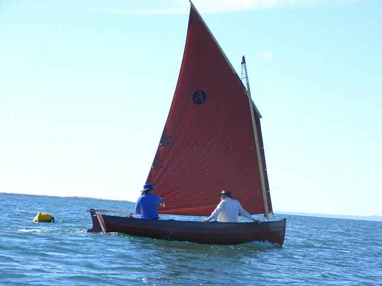
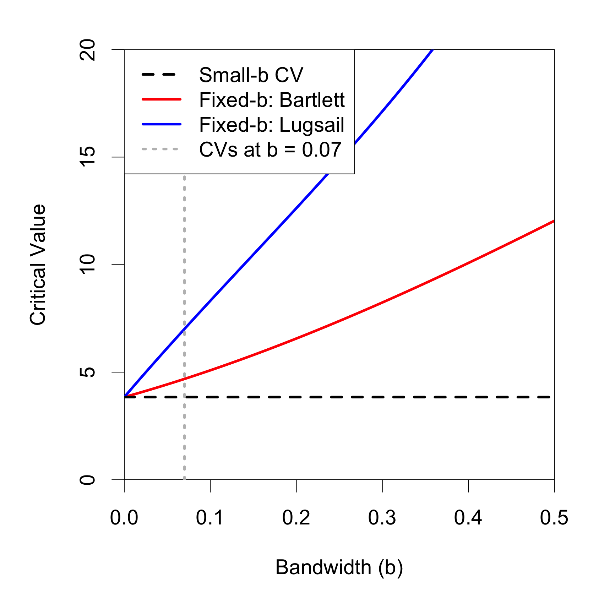
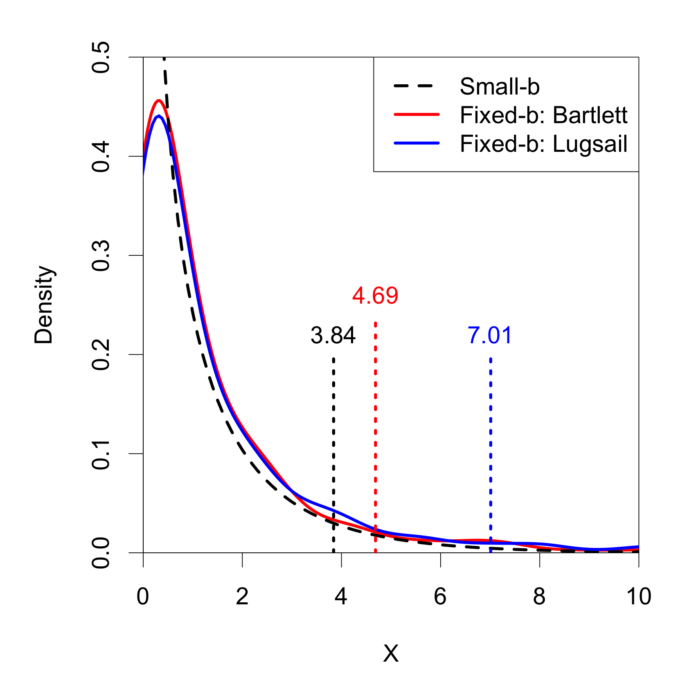
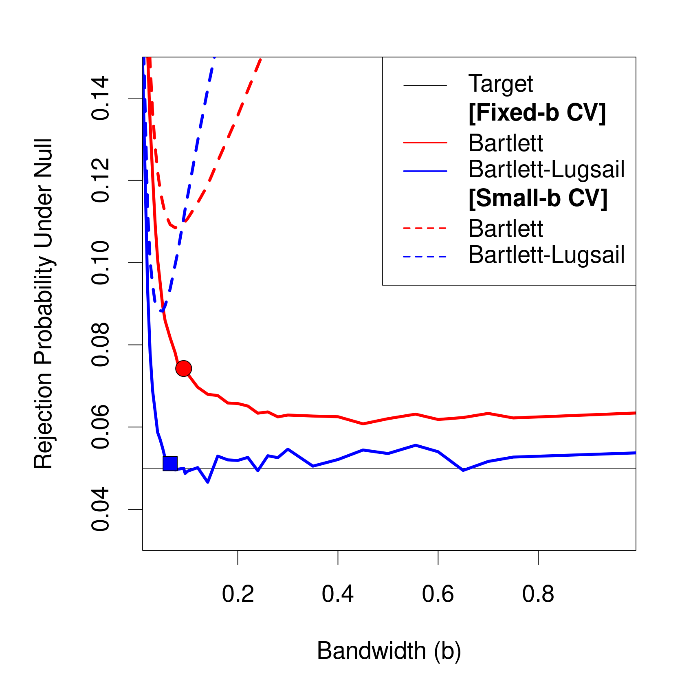
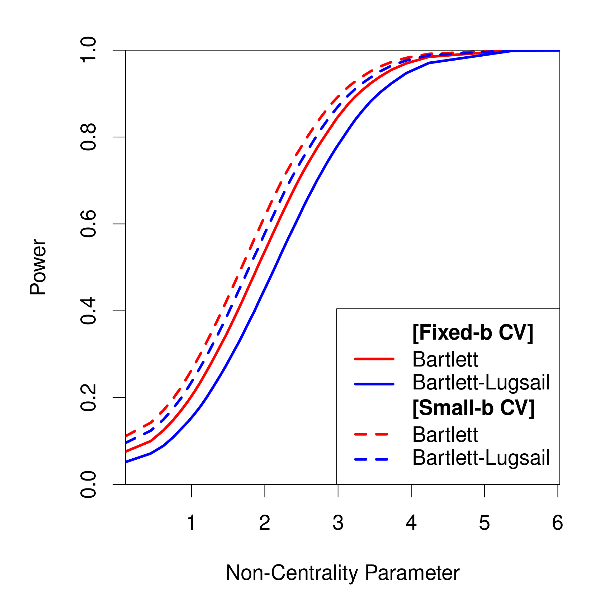

```{r setup, include=FALSE}
knitr::opts_chunk$set(echo = FALSE)
library(shiny)
```

## Outline 

- Review 

- Current Methods 

- New Estimator: Lugsail 

- Fixed-$b$ Asymptotic Theory 

- Testing Optimal Function

- Simulation Evidence 

- Summary 

- Next Steps 

## Brief Review - 1 Sample Test of Means 

<h4>For an simple random sample of iid data $X_1, X_2, \dots X_n$ with mean $\mu$ and standard deviation $\sigma$, we know by the **<span style="color:#2D6CC0">Central Limit Theorem</span>** that </h4>

$$Z := \frac{\overline{X}-\mu}{\sqrt{\sigma/n}} \rightarrow N(0, 1) $$

```{r echo=F, fig.height=3, fig.width=8, fig.align='center'}

par(mfrow = c(1, 2))
hist(rnorm(100), main = "", xlab = "x", prob = T)
curve(dnorm(x), from =-3, to =3, ylab = "p(x)")
par(mfrow = c(1, 1))
```

## Brief Review - 1 Sample Test of Means

<h4>However, in practice when we preform **<span style="color:#2D6CC0"> inference procedures </span>** we typically use the $t$-distribution instead of the normal distribution, especially when</h4>

<br>

- <h4>Sample sizes are small</h4>

- <h4>We estimate $\sigma$ with $s$ or $\hat{\sigma}$</h4>

<h4>Why is this?</h4>

<!-- >- $Z$ *converges* to a normal distribution as the sample size increases. -->

<!-- >- Extra step of estimating $\sigma$ introduces more variability  -->


## Brief Review - 1 Sample Test of Means 


```{r echo=F, fig.height=5, fig.width=8, fig.align='center'}

par(mfrow = c(1, 1))
curve(dnorm(x), from =-4, to =4, ylab = "", lwd = 2,  axes=FALSE, xlab = "")
curve(dt(x, df =3), from =-4, to =4, add = T, col = "blue", lwd = 2, lty =2)
legend("topright", border = "white", legend = c("Z-distr", "t-distr"), 
       lty = c(1, 2), col = c("black", "blue"), lwd = 2, bty = "n")
par(mfrow = c(1, 1))
```


## A General Version of This Problem

- <h4>Dependence structure </h4>

- <h4>Multivariate data </h4>

<br>
<br>
<br>
<center>
{width=50%} 
</center>


## When is this useful? 

- <h4> MCMC Output Analysis (and Bayesian Analysis) </h4>

- <h4> Econometrics (Heteroskedasiticy and Autocorrelation Consistent estimators) </h4>

- <h4> Spectral Analysis </h4>

- <h4> Time Series Models </h4>


```{r, echo = F, warning=FALSE, comment=F, message = F,  fig.width=8, fig.height=3}
library(plotly)
y = rep(0, 100)

for(i in 1:99){
  y[i+1] = 0.7*y[i] + rnorm(1)
}

plot1 <- plot_ly(
          x = 1:100,
          y = y, 
          type = 'scatter',
          mode = 'lines')%>%
          layout(showlegend = F)
plot1
```


## Example Data


```{r, echo = FALSE, message=F, warning=FALSE}
shinyAppFile(
  "ShinyApps/VAR1Process/app.R",
  options = list(width = "100%", height = 700)
)
```


## CLT for VAR(p) Processes ^[@zivot2007modeling]


<h4> Let $Y_t$ be an $q \times 1$ stationary and ergodic multivariate time series with $E(Y_t) = \mu$, then </h4> 

<h4>
$$
        \sqrt{T} (\overline{Y} - \mu) \overset{d}{\rightarrow} N\left (0,  \Sigma\right )
$$
</h4> 
    
where 


$$
    \begin{align*}
        \Sigma =& \sum_{h = -\infty}^\infty \Gamma(h)\\
               =& \sum_{h = -\infty}^\infty Cov(Y_{t}, Y_{t-h})\\
               =& \sum_{h = -\infty}^\infty  E\left [(Y_t - \mu)(Y_{t-h}-\mu)' \right]\\
    \end{align*}
$$


## Model and Test

Model:

$$y_t = \theta_0 + u_t$$


- $y_t$, $\theta_0$, and $u_t$ are all $p \times 1$ vectors 

- $u_t$ is a zero mean random process 

Test:

$$
    \begin{matrix}
    H_0:& r(\theta_0) = 0 \\
    H_A:& r(\theta_0) \neq 0
    \end{matrix}
$$

where $r(\cdot)$ is a $m \geq p$ vector of functions

## Test Statistic

Multivariate 

$$  F_T = \left [ \sqrt{T}\left(\hat{\theta} - \theta_0 \right) \right ]' \hat{\Omega}_T^{-1}\left [ \sqrt{T}\left(\hat{\theta} - \theta_0 \right) \right ]/p$$
Univariate 


$$t = \frac{(\hat{\theta}-\theta_0)}{\sqrt{\hat{\Omega}_T /T}}$$

## What is the problem? ^[@priestley1981spectral]


$$
    \begin{align*}
        \hat{\Sigma}^{(N)} =& \sum_{h = -\infty}^\infty \hat{\Gamma}(h)\\
        = & \sum_{h = -(T - 1)}^{T - 1} \frac{1}{T} \sum_{t=1}^{T - h} (u_t)(u_{t+h} )'\\
         = & \sum_{h = -(T - 1)}^{T - 1} \frac{1}{T} \sum_{t=1}^{T - h} (Y_t - \overline{Y})(Y_{t+h} - \overline{Y})'
    \end{align*}
$$

    
    
- <h4> Infinite variance, no stability. </h4> 


- <h4> Asymptotic results do not always match finite samples. </h4> 


- <h4> Naive estimator may not be positive semi-definite.</h4> 


## Current Estimators
```{=latex}
\begin{align*}
        \hat{\Sigma}^{(K)} =&  \sum_{ h = -(T-1)}^{T-1} \kappa \left (\frac{h}{\textcolor{red}{\left \lfloor  bT \right \rfloor}} \right ) \widehat{R}(h) \\
                     =& \frac{1}{T}\sum_{h= -(T-1)}^{T-1} \kappa \left (\frac{h}{\textcolor{red}{\left \lfloor  bT \right \rfloor}} \right )\sum_{t=1}^{T-h}(Y_t - \overline{Y})(Y_{t+h} - \overline{Y})'\\
                     =& \frac{1}{T} \sum_{t=1}^T \sum_{s=1}^T \kappa\left( \frac{t-s}{\textcolor{red}{\left \lfloor  bT \right \rfloor}}\right ) (Y_t - \overline{Y})(Y_{s} - \overline{Y})'
    \end{align*}
```


$$
\begin{align*}
        \hat{\Sigma}^{(K)} =&  \sum_{ h = -(T-1)}^{T-1} \kappa \left (\frac{h}{\left \lfloor  bT \right \rfloor} \right ) \hat{\Gamma}(h) \\
                     =& \frac{1}{T}\sum_{h= -(T-1)}^{T-1} \kappa \left (\frac{h}{\left \lfloor  bT \right \rfloor} \right )\sum_{t=1}^{T-h}(Y_t - \overline{Y})(Y_{t+h} - \overline{Y})'\\
                     =& \frac{1}{T} \sum_{t=1}^T \sum_{s=1}^T \kappa\left( \frac{t-s}{\left \lfloor  bT \right \rfloor}\right ) (Y_t - \overline{Y})(Y_{s} - \overline{Y})'
\end{align*}
$$

## Common Kernel Functions

```{r, echo = FALSE, message=F, warning=FALSE}
shinyAppFile(
  "ShinyApps/KernelFunctions/app.R",
  options = list(width = "100%", height = 700)
)
```

## Bias of Kernel Estimators ^[@den199712]

$$
 \begin{align*}
        \Sigma = & \sum_{h = -\infty}^\infty \Gamma(h) & \\
               \approx & \sum_{h=-(T-1)}^{T-1} \hat{\Gamma}(h) & \text{ Bias 1}\\
               = & \sum_{h = -\left \lfloor  bT \right \rfloor}^\left \lfloor  bT \right \rfloor \hat{\Gamma}(h) + \sum_{h=-(T-1)}^{-(\left \lfloor  bT \right \rfloor+1)}\hat{\Gamma}(h) + \sum_{h=\left \lfloor  bT \right \rfloor+1}^{T-1}\hat{\Gamma}(h) & \\
               \approx & \sum_{h = -\left \lfloor  bT \right \rfloor}^\left \lfloor  bT \right \rfloor \hat{\Gamma}(h) + 0 + 0& \text{ Bias 2}\\
               \approx & \sum_{h=-\left \lfloor  bT \right \rfloor}^{\left \lfloor  bT \right \rfloor} \kappa \left(\frac{h}{\left \lfloor  bT \right \rfloor} \right )\hat{\Gamma}(h) & \text{ Bias 3}
    \end{align*}
$$


## Kernel Estimators^[@andrews1991heteroskedasticity] {.build}


- <h4>Tuning parameters: $b$, kernel function. </h4>

    + <h4>$b$ estimated by MSE</h4>
    
    + <h4>Several standard kernels recommended. </h4>

- <h4>Might give a positive semi-definite estimate. </h4>

- <h4>Negative bias caused by choice of bandwidth parameter ($b$) and finite sampling.</h4> 

- <h4> Consistent. </h4>

- <h4> Also called Spectral Variance, Newey-West and HAC estimator. </h4>


## Lugsail Estimator 

```{r echo=FALSE, out.width="50%", fig.align = "center"}

```

<h4>
$$
\hat{\Sigma}^{(L)} = \frac{1}{1-c} \hat{\Sigma}^{(K)}_{\left \lfloor  bT \right \rfloor} - \frac{c}{1-c}\hat{\Sigma}^{(K)}_{\left \lfloor  bT/r \right \rfloor}
$$
</h4>


## Lugsail Estimator ^[@vats2018lugsail]


- <h4>Add a positive bias to offset the negative bias of the kernel estimator. </h4>

- <h4>Tuning parameters: $r$, $c$, kernel function, $b$</h4>

    + <h4> $r$ and $c$ determined by amount of negative bias suspected
    
    + <h4> Standard kernels recommended. </h4>

- <h4> Computationally efficient. </h4>

- <h4>Might not be positive semi-definite. </h4>

- <h4> Consistent. </h4>


## Picking Lugsail Parameters

<table>
  <tr>
    <th><p style="color:black;">Correlation</p></th>
    <th><p>Lugsail Window</p></th>
    <th><p>r</p></th>
    <th><p>c </p></th>
  </tr>
  <tr>
    <td>Moderate</td>
    <td>Zero</td>
    <td>2</td>
    <td>$r^{-q}$</td>
  </tr>
    <tr>
    <td>Moderate-High</td>
    <td>Adaptive</td>
    <td>2</td>
    <td>$\frac{\log(T) - \log(\left \lfloor  bT \right \rfloor)+ 1}{r^{q}(\log(T) - \log(\left \lfloor  bT \right \rfloor)) + 1}$</td>
  </tr>
  <tr>
    <td>High-Extreme</td>
    <td>Over</td>
    <td>3</td>
    <td>$\frac{2}{(1+r^q)}$</td>
  </tr>
</table>

<br> 

where 

- <h4> $q$ is the characteristic component of the kernel function </h4>

## Picking Lugsail Parameters

```{r, echo = FALSE, message=F, warning=FALSE}
shinyAppFile(
  "ShinyApps/LugsailFinal/app.R",
  options = list(width = "100%", height = 700)
)
```


## Picking Lugsail Parameters


- <h4>What about $b$?</h4>

- <h4>AMSE is not feasible </h4>

<br>
<br>

<h4>$\Rightarrow$ Consider new loss function</h4>


## Things to consider for an estimator/loss function

- <h4>Bias</h4>

- <h4>Variance</h4>

- <h4>Coverage Probability Error</h4>

- <h4>Size Distortion (Type 1 error) </h4>

- <h4>Power (Type 2 error)</h4>

- <h4>Time</h4>

- <h4>Complexity</h4>

<br>
<br>

<h4> $\Rightarrow$ Testing Optimal Loss Function </h4>

## Testing Optimal Loss Function

$$
Loss = k(\Delta_s)^2 +(1-k) (\Delta_p^{max})^2
$$

where 

- <h4>$\Delta_s$ is the size distortion </h4>

- <h4>$\Delta_p^{max}$ is the size adjusted maximum power loss </h4>

- <h4>$k$ is a tuning parameter (usually 0.9)</h4>

<br>
<br>

- <h4>***Uses fixed-$b$ critical values***</h4>


<!-- ## Fixed-$b$ Asymptotic Theory {.build} -->

<!-- - Small-$b$ asymptotics: assumes that $b \rightarrow 0$ as $T \rightarrow \infty$ -->

<!--    - $\chi^2_{m}$ Critical Values -->

<!-- - Fixed-$b$ asymptotics: assume $b$ is fixed as $T \rightarrow \infty$  -->

<!--    - Non-standard Critical Values  -->

<!--    - Account for the variability of the kernel function, the number of testing restrictions $(m)$, and the bandwidth parameter $(b)$ -->

## Fixed-$b$ Asymptotic Theory  {.columns-2 .smaller}

**Small-b**

- Assumes that $b \rightarrow 0$ as $T \rightarrow \infty$

- $\chi^2_{m}$ Critical Values

- Accounts for the number of testing restrictions $(m)$

<p class="forceBreak"></p>

**Fixed-b**

- Assume $b$ is fixed as $T \rightarrow \infty$ 

- Non-standard Critical Values

- Accounts for the variability of the kernel function, the number of testing restrictions $(m)$, and the bandwidth parameter $(b)$

## Fixed-$b$ Asymptotic Theory

<!-- <center> -->
<!-- {width=45%}  {width=45%}  -->
<!-- </center> -->

<!-- <br> -->
<!-- <br> -->

<!-- Bartlett, $T=200$, $b=0.07$, AR(1) with $\rho = 0.7$, $\alpha = 0.05$ -->

```{r, echo = FALSE, message=F, warning=FALSE}
shinyAppFile(
  "ShinyApps/Small_b_CV_distr/app.R",
  options = list(width = "100%", height = 700)
)
```

## Mini Simulation 


```{r, echo = FALSE, message=F, warning=FALSE}
shinyAppFile(
  "ShinyApps/SimulateCIs/app.R",
  options = list(width = "100%", height = 700)
)
```

## Size Distortion and Power

<center>
{width=45%}  {width=45%} 
</center>
<br>
<br>
Optimal bandwidth for given set up used. 

## Summary 


- <h4> **WHAT?** Testing Optimal Lugsail Estimator for Inference</h4>

- <h4> **WHEN?** Applications in econometrics, time series, spectral analysis, MCMC </h4>

- <h4> **HOW?** Use transformed kernels, alternative assumptions, and new loss function. </h4>

- <h4> **WHY?** Better estimators $\rightarrow$ Better Inference Procedures </h4>

<br>


<center>

{width=30%}

</center>

## Future Directions 

- MCMC

- Estimators: Steep origin and series estimators. 

- Loss functions: Coverage probability error, other testing focused loss functions. 

- Usage: Forecasting.

- Determining Lugsail parameters. 

- Software development. 

<br>
<br>
<center>
{width=35%}
</center>

## Citations


<div id="refs"></div>

